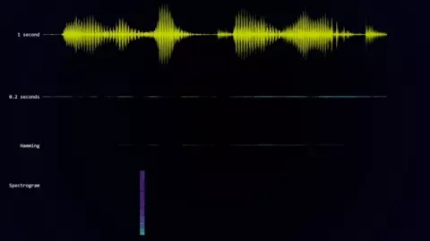
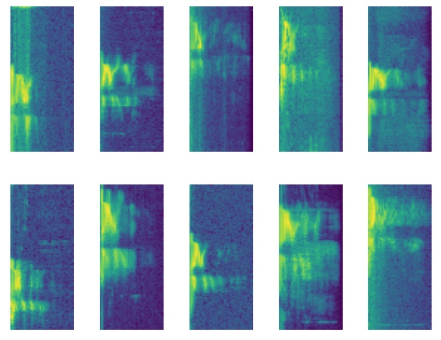
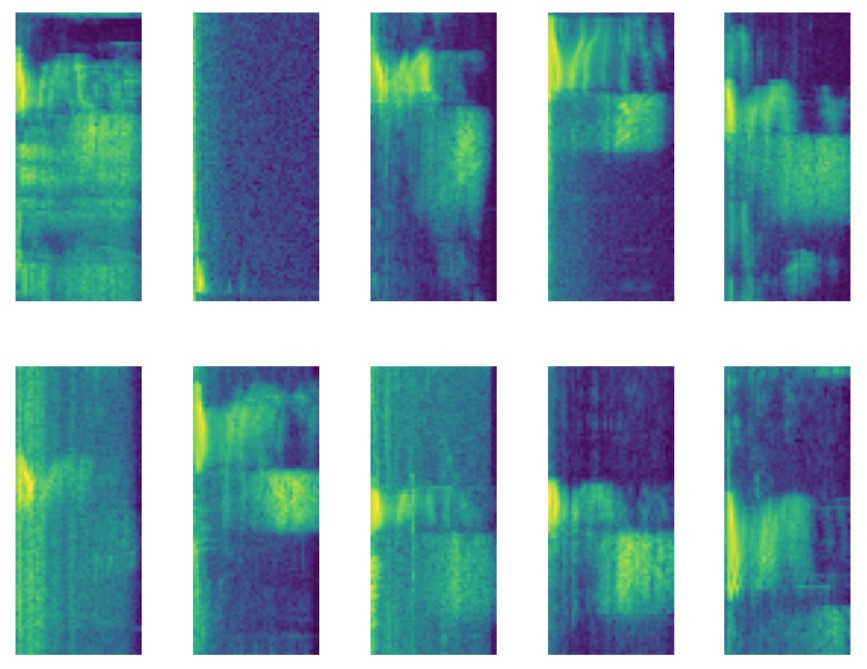

# Setup

## Download training data

```shell
$ cd <project-path>/model
$ mkdir speech-data
$ wget https://storage.cloud.google.com/download.tensorflow.org/data/speech_commands_v0.02.tar.gz
$ tar -xzf data_speech_commands_v0.02.tar.gz -C speech-data
```

To eliminate confusion between other words that start with `Mar` the script called `generate_m_words.sh` which uses the built-in `say` command on the Mac computer to generate speech might be used.

## Install prerequisites

```shell
$ sudo apt update
$ sudo apt install -y python3-dev python3-pip python3-venv
$ python3 -m venv --system-site-packages $HOME/.local/opt/python3/venv/tf
$ source $HOME/.local/opt/python3/venv/tf/bin/activate
$ pip3 install --upgrade pip
$ pip3 install -r requirements.txt
```

## Install additional prerequisites for GPU support (Optional)

```shell
$ wget https://developer.download.nvidia.com/compute/cuda/repos/ubuntu2004/x86_64/cuda-ubuntu2004.pin
$ sudo mv cuda-ubuntu2004.pin /etc/apt/preferences.d/cuda-repository-pin-600
$ sudo apt-key adv --fetch-keys https://developer.download.nvidia.com/compute/cuda/repos/ubuntu2004/x86_64/7fa2af80.pub
$ sudo add-apt-repository "deb https://developer.download.nvidia.com/compute/cuda/repos/ubuntu2004/x86_64/ /"

$ wget http://developer.download.nvidia.com/compute/machine-learning/repos/ubuntu2004/x86_64/nvidia-machine-learning-repo-ubuntu2004_1.0.0-1_amd64.deb
$ sudo apt install ./nvidia-machine-learning-repo-ubuntu2004_1.0.0-1_amd64.deb
$ sudo apt update

# Install NVIDIA driver
$ sudo apt update
$ sudo apt install --no-install-recommends nvidia-driver-510
# Reboot
# Check that GPUs are visible using the command: nvidia-smi

# Install nvinfer
$ sudo apt update
$ wget https://developer.download.nvidia.com/compute/cuda/repos/ubuntu2004/x86_64/libnvinfer8_8.2.3-1+cuda11.4_amd64.deb
$ sudo apt install ./libnvinfer8_8.2.3-1+cuda11.4_amd64.deb

# Install development and runtime libraries (~4GB)
$ sudo apt install --no-install-recommends \
    cuda-11-4 \
    libcudnn8=8.2.4.15-1+cuda11.4  \
    libcudnn8-dev=8.2.4.15-1+cuda11.4

# Install TensorRT. Requires that libcudnn8 is installed above.
$ sudo apt install -y --no-install-recommends \
    libnvinfer8=8.2.3-1+cuda11.4 \
    libnvinfer-dev=8.2.3-1+cuda11.4 \
    libnvinfer-plugin8=8.2.3-1+cuda11.4
```

# Wake Word Detection

To elaborate wake word detection we need to create something that will tell us when a "wake" word is heard by the system. This will need to run on embedded device - an ideal option for this is to use TensorFlow Lite. When the wake word has been detected we start recording of voice and use external facilities to recognize command.

We are going to use this [dataset](https://www.tensorflow.org/datasets/catalog/speech_commands). It contains over 100,000 audio files consisting of a set of 20 core commands words such as "Up", "Down", "Yes", "No" and a set of extra words. Each of the samples is 1 second long. One of these words in particular looks like a good candidate for a wake word - "Marvin".

To augment the dataset we will use background noise, which helps the system to recognize command among present noises.

## Features

With our training data in place we need to think about what features we are going to train our neural network against. It's unlikely that feeding a raw audio waveform into our neural network will give us good results.


A popular approach for word recognition is to translate the problem into one of image recognition.

We need to turn our audio samples into something that looks like an image - to do this we can take a spectrogram.

To get a spectrogram of an audio sample we break the sample into small sections and then perform a discrete Fourier transform on each section. This will give us the frequencies that are present in that slice of audio.

Putting these frequency slices together gives us the spectrogram of the sample.



In the this folder you'll find several Jupyter notebooks. First you need to run Jupyter Notebook:

```shell
$ source $HOME/.local/opt/python3/venv/tf/bin/activate
$ jupyter notebook .
```

Then open `generate.ipynb`, `train.ipynb` and `convert.ipynb` one by one and follow instructions.

## Generate training data

The `generate.ipynb` notebook contains the code required to extract our features from our audio data.

The following function can be used to generate a spectrogram from an audio sample:

```python
def get_spectrogram(audio):
    # normalise the audio
    audio = audio - np.mean(audio)
    audio = audio / np.max(np.abs(audio))
    # create the spectrogram
    spectrogram = audio_ops.audio_spectrogram(audio,
                                              window_size=320,
                                              stride=160,
                                              magnitude_squared=True).numpy()
    # reduce the number of frequency bins in our spectrogram to a more sensible level
    spectrogram = tf.nn.pool(
        input=tf.expand_dims(spectrogram, -1),
        window_shape=[1, 6],
        strides=[1, 6],
        pooling_type='AVG',
        padding='SAME')
    spectrogram = tf.squeeze(spectrogram, axis=0)
    spectrogram = np.log10(spectrogram + 1e-6)
    return spectrogram
```

This function first normalizes the audio sample to remove any variance in volume in our samples. It then computes the spectrogram - there is quite a lot of data in the spectrogram so we reduce this by applying average pooling.

We finally take the log of the spectrogram so that we don't feed extreme values into our neural network which might make it harder to train.

Before generating the spectrogram we add some random noise and variance to our sample. We randomly shift the audio sample the 1-second segment - this makes sure that our neural network generalizes around the audio position.

```python
# randomly reposition the audio in the sample
voice_start, voice_end = get_voice_position(audio, NOISE_FLOOR)
end_gap=len(audio) - voice_end
random_offset = np.random.uniform(0, voice_start+end_gap)
audio = np.roll(audio,-random_offset+end_gap)
```

We also add in a random sample of background noise. This helps our neural network work out the unique features of our target word and ignore background noise.

```python
# get the background noise files
background_files = get_files('_background_noise_')
background_file = np.random.choice(background_files)
background_tensor = tfio.audio.AudioIOTensor(background_file)
background_start = np.random.randint(0, len(background_tensor) - 16000)
# normalise the background noise
background = tf.cast(background_tensor[background_start:background_start+16000], tf.float32)
background = background - np.mean(background)
background = background / np.max(np.abs(background))
# mix the audio with the scaled background
audio = audio + background_volume * background
```

To make sure we have a balanced dataset we add more samples of the word "Marvin" to our dataset. This also helps our neural network generalize as there will be multiple samples of the word with different background noises and in different positions in the 1-second sample.

```python
# process all the words and all the files
for word in tqdm(words, desc="Processing words"):
    if '_' not in word:
        # add more examples of marvin to balance our training set
        repeat = 70 if word == 'marvin' else 1
        process_word(word, repeat=repeat)
```

We then add in samples from our background noise, we run through each background noise file and chop it into 1-second samples, compute the spectrogram, and add these to our negative examples.

With all of this data we end up with a reasonably sized training, validation and testing dataset.



Here's some examples spectrograms of the "Marvin", and here's some examples of the word "yes".



That's our training data prepared, let's have a look at how we train our model up.

## Train model

Open `train.ipynb` notebook and follow instructions. This takes the training, test and validation data that we generated in the previous step.

For our system we only really care about detecting the word Marvin so we'll modify our Y labels so that it is a 1 for Marvin and 0 for everything else.

```python
Y_train = [1 if y == words.index('marvin') else 0 for y in Y_train_cats]
Y_validate = [1 if y == words.index('marvin') else 0 for y in Y_validate_cats]
Y_test = [1 if y == words.index('marvin') else 0 for y in Y_test_cats]
```

We feed this raw data into TensorFlow datasets - we set up our training data repeat forever, randomly shuffle, and to come out in batches.

```python
# create the datasets for training
batch_size = 30

train_dataset = Dataset.from_tensor_slices(
    (X_train, Y_train)
).repeat(
    count=-1
).shuffle(
    len(X_train)
).batch(
    batch_size
)

validation_dataset = Dataset.from_tensor_slices((X_validate, Y_validate)).batch(X_validate.shape[0])

test_dataset = Dataset.from_tensor_slices((X_test, Y_test)).batch(len(X_test))
```

I've played around with a few different model architectures and ended up with this as a trade-off between time to train, accuracy and model size.

We have a convolution layer, followed by a max-pooling layer, following by another convolution layer and max-pooling layer. The result of this is fed into a densely connected layer and finally to our output neuron.

```python
model = Sequential([
    Conv2D(4, 3,
           padding='same',
           activation='relu',
           kernel_regularizer=regularizers.l2(0.001),
           name='conv_layer1',
           input_shape=(IMG_WIDTH, IMG_HEIGHT, 1)),
    MaxPooling2D(name='max_pooling1', pool_size=(2,2)),
    Conv2D(4, 3,
           padding='same',
           activation='relu',
           kernel_regularizer=regularizers.l2(0.001),
           name='conv_layer2'),
    MaxPooling2D(name='max_pooling2', pool_size=(2,2)),
    Flatten(),
    Dropout(0.2),
    Dense(
        40,
        activation='relu',
        kernel_regularizer=regularizers.l2(0.001),
        name='hidden_layer1'
    ),
    Dense(
        1,
        activation='sigmoid',
        kernel_regularizer=regularizers.l2(0.001),
        name='output'
    )
])
model.summary()
```

When I train this model against the data I get the following accuracy:

| Dataset            | Accuracy |
| ------------------ | -------- |
| Training Dataset   | 0.9683   |
| Validation Dataset | 0.9567   |
| Test Dataset       | 0.9562   |

These are pretty good results for such a simple model.

If we look at the confusion matrix using the high threshold (0.9) for the true class we see that we have very few examples of background noise being classified as a "Marvin" and quite a few "Marvin"s being classified as background noise.

|        | Predicted Noise | Predicted Marvin |
| ------ | --------------- | ---------------- |
| Noise  | 13980           | 63               |
| Marvin | 1616            | 11054            |

This is ideal for our use case as we don't want the device waking up randomly.

## Convert model

With our model trained we now need to convert it for use in TensorFlow Lite. This conversion process takes our full model and turns it into a much more compact version that can be run efficiently on our micro-controller.

The `convert.ipynb` notebook passes our trained model through the `TFLiteConverter` along with examples of input data. Providing the sample input data lets the converter quantise our model accurately.

Once the model has been converted we can run a command-line tool to generate C code that we can compile into our project.

```
xxd -i converted_model.tflite > model.cc
```
